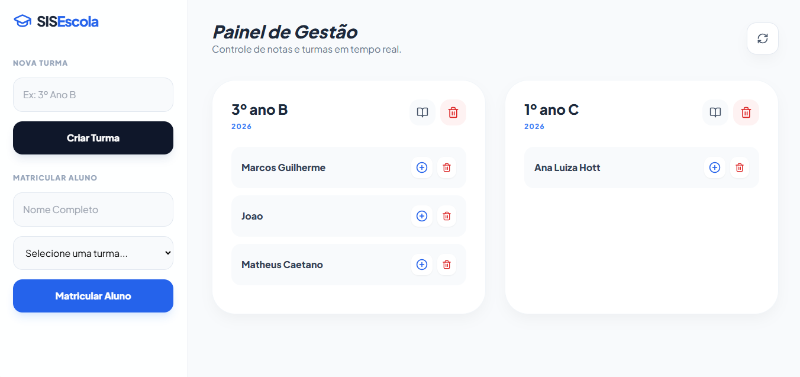
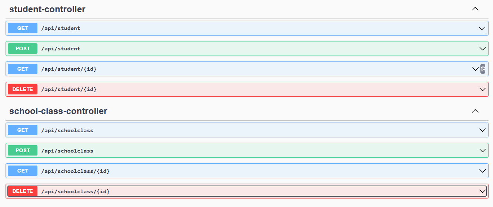

# 🎓 SIS Escola - Sistema de Gestão Escolar

> API REST completa para gerenciamento de turmas, alunos, notas e anotações escolares


---

## 📋 Sobre o Projeto

Sistema backend desenvolvido para **aprendizado e portfólio**, simulando um ambiente real de gestão escolar. O projeto implementa conceitos fundamentais de desenvolvimento backend com Spring Boot, incluindo relacionamentos entre entidades, validações e documentação automática de API.

**🎯 Objetivo Principal:** Demonstrar conhecimentos em arquitetura de software, APIs REST, persistência de dados e boas práticas de desenvolvimento Java.

---

## ✨ Funcionalidades

### 📚 Gestão de Turmas
- ✅ Criar, listar e excluir turmas
- ✅ Visualizar alunos por turma
- ✅ Gerenciar ano letivo

### 👨‍🎓 Gestão de Alunos
- ✅ Matricular alunos em turmas
- ✅ Listar todos os alunos
- ✅ Remover alunos (com cascade de notas)

### 📊 Sistema de Notas
- ✅ Lançar notas com descrição e valor (0-10)
- ✅ Consultar histórico de notas por aluno
- ✅ Editar e excluir notas

### 📝 Diário de Classe
- ✅ Adicionar anotações sobre as turmas
- ✅ Histórico completo de anotações
- ✅ Gerenciar observações do professor

---

## 🛠️ Tecnologias Utilizadas

### Backend
- **Java 17** - Linguagem de programação
- **Spring Boot 4.0** - Framework principal
- **Spring Data JPA** - Persistência de dados
- **Hibernate** - ORM (Object-Relational Mapping)
- **MySQL 8.0** - Banco de dados relacional
- **Maven** - Gerenciador de dependências

### Documentação
- **Swagger/OpenAPI** - Documentação interativa da API
- **SpringDoc OpenAPI UI** - Interface visual para testar endpoints

### Frontend (Demonstração)
- HTML5 + CSS3 + JavaScript
- Tailwind CSS - Estilização
- Lucide Icons - Ícones

---

## 🏗️ Arquitetura do Projeto

O projeto segue o padrão de **arquitetura em camadas**, separando responsabilidades:

```
src/main/java/com/guilherme/sisescola/
│
├── 📁 controller/          # Camada de controle (REST Controllers)
│   ├── SchoolClassController.java
│   ├── StudentController.java
│   ├── GradeController.java
│   └── NoteController.java
│
├── 📁 service/             # Camada de negócio (Business Logic)
│   ├── SchoolClassService.java
│   ├── StudentService.java
│   ├── GradeService.java
│   └── NoteService.java
│
├── 📁 repository/          # Camada de dados (JPA Repositories)
│   ├── SchoolClassRepository.java
│   ├── StudentRepository.java
│   ├── GradeRepository.java
│   └── NoteRepository.java
│
├── 📁 model/               # Entidades do banco de dados
│   ├── SchoolClass.java
│   ├── Student.java
│   ├── Grade.java
│   └── Note.java
│
└── SisescolaaApplication.java  # Classe principal
```

### 📊 Diagrama de Relacionamentos

```
SchoolClass (Turma)
    │
    │ 1:N
    ├─────> Student (Aluno)
    │           │
    │           │ 1:N
    │           └─────> Grade (Nota)
    │
    │ 1:N
    └─────> Note (Anotação)
```

---

## 🚀 Como Executar o Projeto

### Pré-requisitos

- Java 17 ou superior
- MySQL 8.0 ou superior
- Maven 3.6+
- IDE (IntelliJ IDEA, Eclipse ou VS Code)

### Passo a Passo

**1. Clone o repositório:**
```bash
git clone https://github.com/marcosfernandesg/sis-escola.git
cd sis-escola
```

**2. Configure o banco de dados:**

Crie o banco MySQL:
```sql
CREATE DATABASE `sis-escola`;
```

**3. Configure as credenciais:**

Edite o arquivo `src/main/resources/application.properties`:
```properties
spring.datasource.url=jdbc:mysql://localhost:3306/sis-escola
spring.datasource.username=seu_usuario
spring.datasource.password=sua_senha
spring.jpa.hibernate.ddl-auto=update
```

**4. Execute o projeto:**
```bash
mvn spring-boot:run
```

Ou pela IDE: Execute a classe `SisescolaaApplication.java`

**5. Acesse a aplicação:**

- **API Base:** http://localhost:8080/api
- **Swagger UI:** http://localhost:8080/swagger-ui.html
- **Frontend (demo):** Abra o arquivo `index.html` no navegador

---

## 📡 Endpoints da API

### 🏫 Turmas (`/api/schoolclass`)

| Método | Endpoint | Descrição |
|--------|----------|-----------|
| `GET` | `/api/schoolclass` | Lista todas as turmas |
| `GET` | `/api/schoolclass/{id}` | Busca turma por ID |
| `POST` | `/api/schoolclass` | Cria nova turma |
| `DELETE` | `/api/schoolclass/{id}` | Deleta turma (cascade) |

**Exemplo de requisição POST:**
```json
{
  "name": "3º Ano B",
  "schoolYear": 2026
}
```

---

### 👨‍🎓 Alunos (`/api/student`)

| Método | Endpoint | Descrição |
|--------|----------|-----------|
| `GET` | `/api/student` | Lista todos os alunos |
| `GET` | `/api/student/{id}` | Busca aluno por ID |
| `POST` | `/api/student` | Matricula novo aluno |
| `DELETE` | `/api/student/{id}` | Deleta aluno (cascade) |

**Exemplo de requisição POST:**
```json
{
  "name": "João Silva",
  "schoolClass": {
    "id": 1
  }
}
```

---

### 📊 Notas (`/api/grades`)

| Método | Endpoint | Descrição |
|--------|----------|-----------|
| `GET` | `/api/grades/student/{studentId}` | Busca notas de um aluno |
| `POST` | `/api/grades` | Lança nova nota |
| `DELETE` | `/api/grades/{id}` | Deleta nota |

**Exemplo de requisição POST:**
```json
{
  "description": "Prova de Matemática",
  "value": 8.5,
  "student": {
    "id": 1
  }
}
```

---

### 📝 Anotações (`/api/notes`)

| Método | Endpoint | Descrição |
|--------|----------|-----------|
| `GET` | `/api/notes/class/{classId}` | Busca anotações de uma turma |
| `POST` | `/api/notes` | Cria nova anotação |
| `DELETE` | `/api/notes/{id}` | Deleta anotação |

**Exemplo de requisição POST:**
```json
{
  "content": "Turma participativa, necessita reforço em álgebra.",
  "schoolClass": {
    "id": 1
  }
}
```

---

## 📸 Screenshots

### 🖼️ Interface Principal

*Visão geral das turmas e alunos*

### 📊 Lançamento de Notas

*Sistema de notas com histórico*

### 📖 Documentação Swagger

*Documentação interativa da API*

> **📌 Nota:** Crie uma pasta `screenshots/` na raiz do projeto e adicione prints do sistema funcionando!

---

## 🧪 Testando a API

### Usando Swagger UI (Recomendado)

1. Acesse: http://localhost:8080/swagger-ui.html
2. Navegue pelos endpoints
3. Clique em "Try it out"
4. Preencha os dados e execute

### Usando cURL

**Criar uma turma:**
```bash
curl -X POST http://localhost:8080/api/schoolclass \
  -H "Content-Type: application/json" \
  -d '{"name":"3º Ano A","schoolYear":2026}'
```

**Listar turmas:**
```bash
curl http://localhost:8080/api/schoolclass
```

---

## 🎯 Conceitos Aplicados

Este projeto demonstra conhecimento em:

- ✅ **Arquitetura em Camadas** (Controller → Service → Repository)
- ✅ **RESTful API** (verbos HTTP, status codes, JSON)
- ✅ **JPA/Hibernate** (ORM, relacionamentos, cascade)
- ✅ **Relacionamentos** (@OneToMany, @ManyToOne)
- ✅ **Validações** (Bean Validation)
- ✅ **CORS** (Cross-Origin Resource Sharing)
- ✅ **Documentação** (Swagger/OpenAPI)
- ✅ **Boas Práticas** (Clean Code, separação de responsabilidades)

---

## 📚 Aprendizados

Durante o desenvolvimento deste projeto, foram aplicados:

- Configuração de relacionamentos bidirecionais com JPA
- Resolução de problemas de referência circular com `@JsonManagedReference` e `@JsonBackReference`
- Implementação de cascade delete para integridade referencial
- Configuração de CORS para integração frontend-backend
- Documentação automática de APIs com SpringDoc OpenAPI
- Tratamento de exceções e respostas HTTP adequadas

---

## 🔜 Próximas Melhorias

Funcionalidades planejadas para versões futuras:

- [ ] Sistema de autenticação (Spring Security + JWT)
- [ ] Cálculo automático de médias
- [ ] Dashboard com estatísticas (gráficos)
- [ ] Sistema de frequência/presença
- [ ] Upload de foto dos alunos
- [ ] Exportação de relatórios (PDF)
- [ ] Testes unitários (JUnit + Mockito)
- [ ] Deploy em cloud (Railway/Render)

---

## 🤝 Contribuindo

Este é um projeto de aprendizado, mas sugestões são bem-vindas!

1. Faça um Fork do projeto
2. Crie uma branch para sua feature (`git checkout -b feature/MinhaFeature`)
3. Commit suas mudanças (`git commit -m 'Adiciona MinhaFeature'`)
4. Push para a branch (`git push origin feature/MinhaFeature`)
5. Abra um Pull Request

---

## 📝 Licença

Este projeto está sob a licença MIT. Veja o arquivo `LICENSE` para mais detalhes.

---

## 👨‍💻 Autor

**Marcos Guilherme Fernandes Pereira**

- GitHub: [@marcosfernandesg](https://github.com/marcosfernandesg)
- LinkedIn: https://www.linkedin.com/in/marcos-guilherme-fernandes/
- Email: contatomarcosfg@gmail.com

---

## ⭐ Agradecimentos

Projeto desenvolvido como parte dos estudos em **Desenvolvimento Backend com Spring Boot**.

Se este projeto te ajudou de alguma forma, considere dar uma ⭐!

---

<div align="center">
  Feito com ☕ e 💻 por Marcos Guilherme
</div>
